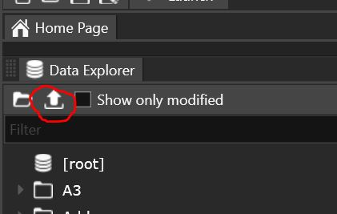

# FrostyToolsuiteExporter
A modified version of FrostyToolsuite designed for exporting assets, most notably featuring a batch exporter. The number of supported filetypes will increase with updates.

## Batch Export Filetypes

* Static Mesh (RigidMeshAsset, CompositeMeshAsset)

## Performance

Exports every static mesh from the game (14,066 assets) in about 25 minutes.

## Batch Export Instructions

1. Select a folder
2. Click button

3. Specify root path
4. ???
5. Profit

## Setup

1. Download Git https://git-scm.com/download/win.
2. Create an empty folder, go inside it, right click an empty space and hit "Git Bash Here". That should open up a command prompt.
3. Press the green "Code" button in the repository and copy the text under "HTTPS".
4. Type out ``git clone -b <branch_name> <HTTPS code>`` in the command prompt and hit enter. This should clone the project files into the folder.
5. Open the solution (found under FrostyEditor) with **Visual Studio 2019**, and make sure the project is set to ``DeveloperDebug`` and ``x64``. Close out of retarget window if prompted.
6. Only build the projects themselves, never the solution.

## License
The Content, Name, Code, and all assets are licensed under a Creative Commons Attribution-NonCommercial-NoDerivatives 4.0 International License.
